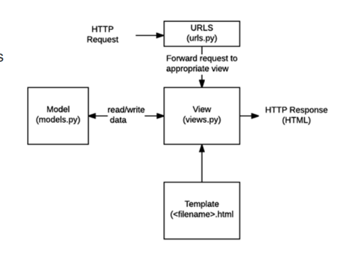
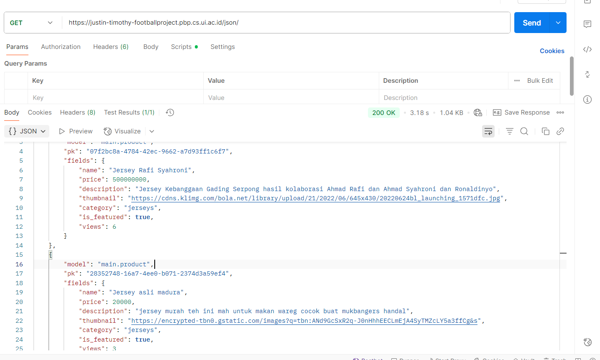
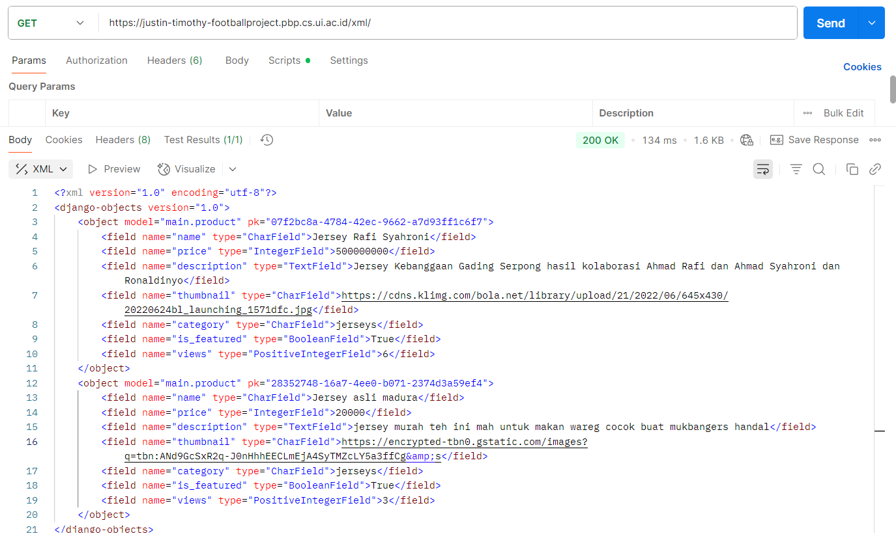
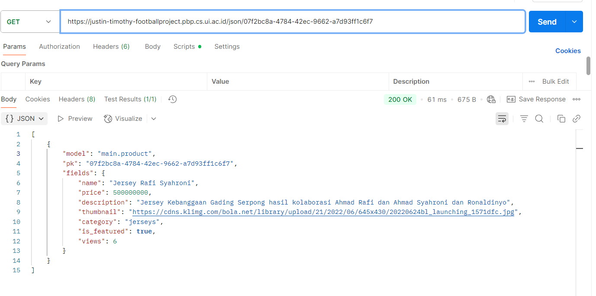
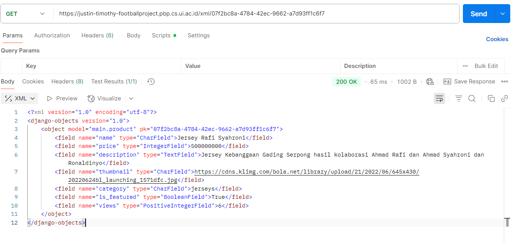

# Link Menuju PWS
https://justin-timothy-footballproject.pbp.cs.ui.ac.id/

## Jawaban atas Pertanyaan
- Cara saya mengimplementasikan step by step,
pertama-tama setting virtual env dulu untuk isolasi dependencies dan mencegah tabrakan versi dan dependensi dengan projek lain. lalu siapkan dependiences yg ingin didownload dan masuk ke venv lalu download. mulai projek dengan startproject. di dalam project ada wsgi,asgi,urls, settings. urls untuk routing level proyek dan settings untuk mengatur banyak hal; mostly saat run server di deployment/production. lalu kita buat aplikasi (main) kalau disimplifikasi mungkin semacam fitur sebutannya, jangan lupa untuk mengaitkan app main di installed_apps di projek. lalu kita rutekan pada urls.py di level proyek untuk  path '' menuju main.urls. Next, di folder main kita rubah file models.py untuk membuat class/ model baru bernama Product. ada category-choices berupa tuple untuk menandakan kategori pilihan. lalu membuat beberapa method untuk return name dan melakukan beberapa perhitungan, buat variable dengan tipe fieldnya, misal name = model.CharField() yang bisa kita passing beberapa argumen. di views.py kita import fungsi render untuk mereturn main.html (yang bisa mengakses variabel dari context berupa dictionary key value di fungsi show_main yg kita buat).

urls.py mengimpor fungsi dari views.py untuk nantinya di eksekusi ketika pengguna menuju path yg didefinisikan di urls.py. lalu add commit dan deploy ke PWS. (Btw saya sempat beberapa kali error, karena SECRET_KEY ku berada di line sebelum production, sehingga SECRET_KEY grebnya dari .env bukan .env.prod)

-. 

- Jadi pertama tama user akan request ke internet, internet akan request ke webserver kita dengan django sebagai backendnya. Lalu akan minta ke urls.py, setelah itu di urls.py, akan dikategorikan berdasarkan urls yang dituju, fungsi manakah dari views.py yang dieksekusi, fungsi show_main misalnya. views ini menjadi business logic layer, menjembatani models dan template, semisal lebih dari sekedar eksekusi html, maka bisa saja mengirim data menuju database atau sesimpel crud operations. anyways dari view bisa read/write data dari models. Jadi, views bisa read/write data tapi yang paling simpelnya itu menerima request http lalu merender main.html, main.html juga bisa mengakses dictionary di views, jadi kalau views greb data dari models lalu dikirm ke diproses dengan forloop di .html lalu dikirim ke user itu sangat memungkinkan.

- Peran settings.py dalam proyek Django itu sangat vital, dimulai dari keamanan, middleware, sampai menjaga env dengan menggunakan dotenv. secara keseluruhan settings itu untuk mengatur jalannya projek django dari keamananan, deployment, production yang meliputi database, timezone, app and extension allowed di app tersebut

- Cara kerja migrasi database di Django adalah: makemigrations untuk membuat berkas migrasi yang berisi perubahan model yang belum ada di basis data, sedangkan migrate adalah untuk mengaplikasikan perubahan yg tercantum di berkas migrasi ke dalam basis data lokal. tanpa dua proses ini maka tidak akan terupdate di database nya.

- Framework django dijadikan permulaan pembelajaran pengembangan perangkat lunak karena sangat mudah dipahami dan easy to read. Secara garis besar jelas sekali yaitu MVT, model view template. Per bagian juga jelas ada urlsnya untuk routing, views untuk menghubungkan model dan template kalau di filenya menghubungkan dengan menerima http respons dan send html. Language menggunakan python, easy dibanding c++. Banyak dokumentasi dan built in yang sudah enak tinggal startapp, startproject.

- Sementara ini belum ada feedback karena asisten dosennya cukup fast respon di grup. Saya sendiri belum bisa menilai banyak karena untuk tutorial cenderung straight forward. Tetapi untuk salah satu asisten dosen yang mengajar di tutorial 0 sangat kompeten menurut saya.

## Jawaban atas Pertanyaan; Tugas 3;
- data delivery secara pengertian adalah cara untuk mengirimkan data antar berbagai bagian dalam arsitektur aplikasi. misal frontend mengambil data ke backend. hal ini penting karena komunikasi menjadi efektif, django orm yang membuka postgre, atau javascript yang meminta data dari django lalu django meminta dari sql. tiga tipe format data yang biasa digunakan dalam fdata delivery adalah html, xml dan json.. hal ini penting karena data delivery memudahkan proses. backend django ini nantinya akan mereturn bukan hanya httpresponse tapi bisa juga jsonresponse. ini sangat penting apalagi ketika nanti dikonek ke api. bahkan nantinya bisa lebih scalability dan memungkinkan adanya ajax.

- json lebih baik untuk banyak usecase. hal ini dikarenakan dibanding xml, json lebih cepat dan ringan, disuppport oleh native js juga karena json sendiri javascriprt object notation, lebih populer di kalangan developer, readable dan biasanya digunakan di rest api. xml biasanya untuk legacy system, atau yang butuh hierarchy, enterprise atau complex schema requirement.

- fungsi dari method is_valid() di Django adalah untuk validasi data form di django. harus sesuai dengan fieldnya, lalu misal panjang character harus berapa, apakah required untuk diisi atau tidak. sebenarnya ini sangat penting karena kalau data dari user gak sesuai dan kita tetap kirim ke database, kemungkinan nanti akan ada invalid datatype dan bahkan sebelum disave itu gabakal kesimpan dengan valid atau kesimpan sama sekali. 

- csrf_token itu dibutuhkan saat membuat form di django untuk mencegah serangan Cross_Site Request Forgery. untuk ngecek bahwa post yang dilakukan ke server itu berasal dari form yang sah dari ketikan kita bukan dari sumber eksternal. Token divalidasi untuk mengecek apakah yang mengirim post request itu pengguna valid atau attacker. 
Jika form kita tidak menyertakan csrf token, maka django bisa menolak dengan respons http 403 forbidden karena tak ada token yang menjamin bahwa kita bukan attacker, lalu jika kita nonaktifkan maka form kita bisa rentan kena csrf dan mengirim sesuatu ke server tanpa sepengetahuan kita mengatasnamakan kita. 
Hal ini dapat dimanfaatkan peyerang. ketika kita telah mempunyai session aktif di dalam django webnya, maka attacker bisa eksekusi script ketika kita install sesuatu atau mengunjungi web mereka, sehingga kita akan secara tanpa sadar mengirimkan post request ke server, bisa membeli sesuatu, atau merubah password, dan hal tersebut akan dianggap tindakan sah oleh server karena dieksekusi oleh browser kita dengan cookie yang valid.

- saya mengimplementasikan checklist diatas seperti ini: pertama yaitu disuruh membuat 4 fungsi views baru untuk melihat objek yang sudah ditambahkan ke database dengan xml,json,json_by_id dan xml_by_id. saya membuat masing masing fungsi, jadi dari model bernama Product saya lakukan grab semua object yang exist dengan Product.objects.all(), lalu saya ubah dengan serializers sesuai data format yang dinginkan dan return httpresponse dengan content_typenya. Kalau show by id maka di filter bukan take all, filter sesuai id dan kalau gak exist, maka return response status 404.
Lalu untuk routingnya saya buat path baru di urls.py misal path json/ eksekusi show_json, kalau json/<str:product_id> itu untuk menjelaskan bahwa product_id akan berupa string dan didalam url kita itu product_id nanti akan disend ke fungsinya. karena ingat fungsinya menerima dua parameter yaitu request dan product_id.

Membuat page yang punya tombol add dan detail product itu cukup simpel juga, kita tambahkan di main.html di halaman utama yaitu elemen elemen html seperti button yang akan referensikan ke fungsi create_product, yaitu yang di urls.py yang kita buat juga, nanti di url tersebut akan dieksekusi fungsi create_product, yang merender create_product.html yaitu sebuah form dengan wajib csrf token, nanti dari situ jika isi formyna valid akan disave dan dikirim ke database. hal ini kita definiskan di fungsi yang ada di views.py. jangan lupa redirect ke menu utama.
untuk bagian yang detail, ingat bahwa di menu utama kita iterasi ke semua product di product_list dan di print semuanya di menu utama. nah, kan ketauan bahwa per row itu ada product yang di print dengan product.thumbnail, product.name, product.featured dsb. salah satunya itu button yang jika dipencet akan mengarah ke app main dan eksekusi show_product, dengan mengirimkan argumen product.id ke si show_product tersebut, sehingga show_product tau harus show product yang mana. sudah deh, di product_item juga memprint per attribute, lalu ada beberapa yang if else juga kalau attribute itu tidak wajib dan required, seperti thumbnail.

- tidak ada feedback, asdos sudah sangat baik dalam penjelasan dan bantuan 

-

-

-

-

## Jawaban atas Pertanyaan; Tugas 4;
- Django AuthenticationForm adalah sebuah fitur yang sudah built in dari django untuk menangani proses login/autentikasi, hal ini untuk memverifikasi dan validasi username dan password apakah ada di database atau tidak. kelebihannya itu dia ada validasi built in sprti formatnya username, apakah user ada, lalu security juga aman karena mencegah csrf dan cross site scripting. intinya mudah digunakan, simpel dan error handlingnya baik. Untuk kekurangannya dia terbatas untuk styling dan renderingnya, biasanya sebagai paragraph atau table yg umum. harus disesuaikan ulang kalau mau complex auth yang ada rate limiting, dia juga cukup dependent sama user model yang django. ya walaupun dia simpel dan mudah template tapi tetap ada kekurangannya.

- Autentikasi itu pengertiannya untuk mengecek siapa kita? jangan sampai kita login dan menyamar sebagai orang lain, harus terverifikasi bahwasannya kita adalah benar-benar rill dan bukan pemalsuan. Kalau Otorisasi itu untuk mengecek apa yang boleh kita lakukan? misal kita mempunyai role apa maka diberikan otoritas untuk mengerjakan apa saja, setelah kita terautentikasi merupakan seseorang dengan role apa, maka kita bisa di authorize untuk melakukan edit post, atau bahkan delete post jika admin.
Django mengimplementasikan kedua hal tersebut seperti ini; untuk autentikasi,ada django.contrib.auth yang menyediakan user model untuk ngecek siapa usernya, dipakai saat login dan logout yang dimana nantinya akan menggunakan session untuk menyimpan status login setelah autentikasi berhasil. Kalau otorisasi itu kita pakai model Permissions dan bisa mendefinisikan bahwa suatu function hanya bisa di run ketika memmiliki @permission_required yang dimana menerima parameter, karena permission_required ini semacam function. atau bisa juga buat Group di models untuk nanti dimasukkan user ke dalam grup tersebut. nanti grup tersebut dan semua orang didalamnya dapat mengakses sesuatu, misal grouping dosen / mahasiswa. Bisa juga custom permissions sesuai keinginan kita atau menggunakan object level seperti library django-guardian

- Session; Kelebihan: Aman, disimpan di dalam server, kapasitas besar dan memiliki server side control. Kekurangan: Memakan Resource server, sehingga butuh scalability dan load balancing yang baik untuk aplikasi skala besar. Session storage down, maka semua user terpengaruh, perlu cookies untuk menyimpan session id.
Cookies; Kelebihan: client side, local storage sehingga lebih cepat, server tidak perlu menyimpan state, bisa berguna data cookies ini untuk aplkiasi yang disediakan offline karena tidak perlu fetch data dari server lagi. Kekurangan: Ukuran terbatas, keamanan kurang karena di client side sehingga rawan xss, browser dependency, karena cookies dikirim setiap http request bisa membuat request header sedikit lebih banyak.

- Kurang aman, karena cookies sangat rawan xss dan csrf. bisa diambil cookienya dengan script javascript sprti document.cookie jika masuk ke web berbahaya, lalu csrf attack juga sangat mungkin karena saat kita mengirim request ke sebuah domain tertentu maka akan disertakan cookies nya, masalahnya ketika masuk web jahat, attacker bisa mengirim dengan script dan langsung kekirim seolah itu kita, tapi dengan csrf token, maka ketika mengirim sesuatu si attacker perlu menjelaskan jug apa csrfmiddlewaretokennya yang mereka tidak dapatkan sehingga tidak bisa kesend. Nah django menangani ketidakamanan cookies ini dengan csrf token untuk mencegah cross site request forgery. intinya ada token unik per session yang tidak bisa diambil oleh attacker. why? karena csrf_token ini unik berasal dari server, dia cuma bisa same origin policy dan dibaca oleh html gabisa dibaca oleh si attacker karena adanya cors orgin jahat dan origin browser kita gak bisa berinteraksi dan pengaksesan element, sesimpel mengirim request saja baru bisa.

- cara implementasi checklist; untuk registrasi pertama-tama saya import usercreationform dan messages. di views.py buat fungsi register intinya kalau form itu method POST dan valid maka di save dan redirect ke login. buat register.html di main/templates untuk yang ditampakkan di html di browser ke user saat ingin daftar jangan lupa csrf token dan form as table. di urls.py ktia import fungsi dan url routing ketika ke register/ maka execute function itu. 

Untuk login kita tambahkan import authenticate login dan Authentication form. buat fungsinya juga, intinya ini ngecek apakah exist di database dan valid usernya exist, kalau iya maka di redirect ke fungsi show_main untuk halaman utama di views.py. Jangan lupa buat login.html untuk tampilan di user ketika ingin login seperti apa. anyways seperi bisa buat di urls.py untuk routing saat mengakses url login/ maka akan eksekusi fungsi login_user di views.py untuk nantinya ngetamppilkan login.html, dan setelah berhasil maka diredirect ke show_main, link akan berubah dan mengeksekusi fungsi untuk menampilkan semua product.

Untuk logout import logout, ya sama ngelogout maka balik halaman login, jangan lupa buat url routing di urls.py dan buat tampilan html nya . oya untuk semua step di urls.py jangan sampai lupa untuk import fungsi dari views.py yaa

menghubungkan model product dengan user cuma import models User bawaan django, lalu jadikan sebagai foreignkey jadinya satu user bisa punya banyak news. di migrate, fungsi di main lalu modifikasi fungsi untuk bisa memfilter by user dan untuk semuanya. dan fungsi show_main jgn lupa dimodif juga dan harus login_required. loggedin dan cokkies tinggal import reverse, datetime dan httpresponseredirect. nanti setcookie lastlogin dengan saat itu ketika baru login. nanti saat logout itu didelete cooki lastloginnya. nah last_login ini nanti dikirim ke html lewat render dan intinya lewat dictionary key value, nah keynya last_login valuenya itu lastlogin di cookienya. nanti tinggal di print id html pakai {{}}. btw untuk username itu bisa pkaai news.user.username untuk saat cek new detail tapi ketika login itu pakai request.user.username kearena kan ketika diakses itu ada request sebelum showmain nah dari situ user yang request akan ketauan siapa dan bisa di grab key username untuk diambil valuenya nanyi apa.

## Jawaban atas Pertanyaan; Tugas 5;
- Jika terdapat banyak CSS Selector, maka urutan prioritas sebenarnya ada cara penghitungannya. Tetapi secara general itu Inline, ID Selector, Class Selector; Attribute; Pseudo-Class; dan Element yang paling bawah.!important bisa override semuanya, * itu karna pilih semuanya maka paling unspesifik. Btw cara penghitungan itu (ID, CLASS, PSEUDO-class, ELEMENT) jadi kalau susatu element punya dua class dan diambil maka dia jadi (0,2,0,0) dan masih kalah terhadap pemilihan id yaitu (1,0,0,0)

- responsive design itu sangat penting karena sebuah web harus bisa diakses di berbagai gawai, untuk memudahkan aksesnya dan lebih meluas karena bisa dijangkau oleh para penduduk yang belum punya laptop/pc atau device dengan width dan height yang besar. https://tim48-robot.github.io/Sign-up-Form/ contoh yang belum responsive (karena gak ketemu website lain haha), lalu yang sudah menerapkan contohnya seperti instagram.com / web pertanian.go.id . Alasan? Karena web tersebut jadul atau untuk mendukung versi yang lama banget biasanya. Sehingga belum diupdate untuk responsive, most web yang dideploy di masa sekarang harus responsive karena itu salah satu syarat termudah untuk dipenuhi untuk menjangkau banyak user juga.

- hmm, kalau kita mempunyai suatu elemen html yang mau kita style dengan css margni itu artinya jarak antara item tersebut dengan item lain, bisa margin top bottom margin left atau margin right. tinggal diimplementasikan saja dengan margni-left: 1rem atau 20px misalnya; kalau border itu serprti outline element yang ditebelin atau menjadi ada. umm kalau untuk implementasinya biasanya aku pakai shorthand kayak border: 2px solid black; untuk mendefinisikan warna ukuran dan tipenya yaitu solid, atau juga yg putus putus itu bebassih. btw beda sama outline ya, tapi kalau dalam bahasa yang mudah dimengerti itu mirip outline. kalau padding itu seperti centering text didalam element. jadi kayak jarak antara text ke border? bukan tapi lebih ke area terluar elemen? kalau gaada padding biasanya jelek banget karena gaada spacing dan semisal kita punya kotak 2px x 2px, maka tulisannya juga 2px x 2px sehingga ukuran kotak = ukuran tulisan, jadi agak jelek gitulah. padding: 2px atau padding: 2rem atau 2em bebas.

- flexbox itu adalah suatu cara display di dalam css, ini berbeda dengan block, inline atau inline-block, flex itu flexbox / lebih special karena ada container dan anak-anaknya. Kenapa ada display flex? Kegunaannya untuk mengatur posisi item atau dari childrennya. yaa ada inline-flex juga sih. anyway untuk containernya itu kita bisa atur direcitionnya, btw flex itu secara default kolom yaitu ke kanan, kalau ke bawah itu default dari block, kalau inline itu defaultnya ke kanan juga sih, jadi sampe width nya abis dulu baru kebawah. Anyways di conitainer nanti kita atur posisi item dalam horizontal dan vertikal serta wrapping bila ga muat di oneline. untuk flex children dia kita atur bisa grow, shrink seberapa banyak tergantung space yang available , misal 1 2 1 maka yang 2 dapet space dua kali lipat dibanginkan elemen lain. lalu ada basisnya dia harus seberapa sih sblm space itu dialokasikan. lalu ada order, ini sbnrnya biasanya udah diatur kalau kita masukkan di inrdex.html nya itu div urutan ke berapa, cmn order bisa ngeredefine itu sih. ada align-self juga
- kalau grid itu cara display dimana dia punya template column/rows, mungkin kalau secara kasarnya itu mirip kotak kotak yang sizenya bebas berapa, didefine dengan grid-template, yaa mirip dia containernya bisa ngatur posisi vertikal dan horizontal untuk child. Kegunaan utama grid dibanding flexbox itu biasanya kalau grid kita bisa lihat dia dua arah kayak atas bawah jadi ga terbatas di satu arah kayak flexbox, tapi more than that sebenernya grid itu dipake kalau kita udah atau mau struktur yang kayak gimana jadi bisa dipetakan dengan lebih enak lah istilahnya. tapi kalau flex sendiri biasanyaa dipakai kalau kita tau secara kasarnya gimana dan belum terlalu mau diatur dipetakannya gimana. Grid juga btw childrennya bisa kita atur masuk di row / column keberapa dan kita span, banyak fleksibilitas sih di grid jadi tergantung penggunaan juga. 

- cara mengimpelemetnasikan checklist di atas step bty step. 
Untuk mengimplementasikan fungsi hapus dan edit product, pertama-tama saya membuat dua fungsi baru di views.py yaitu edit_product dan delete_product. Fungsi edit_product menerima parameter request dan id sebagai identifier product yang akan diedit. Di dalam fungsi ini, saya menggunakan get_object_or_404 untuk mengambil object product berdasarkan primary key dan memastikan product tersebut milik user yang sedang login dengan menambahkan filter user=request.user. Jika request method adalah POST dan form valid, maka data product akan di-update dan user akan diredirect ke halaman utama. Sedangkan untuk fungsi delete_product, prosesnya lebih sederhana yaitu cukup mengambil object product dengan cara yang sama, kemudian memanggil method delete() dan redirect ke halaman utama menggunakan HttpResponseRedirect dan reverse. Kedua fungsi ini juga saya tambahkan decorator @login_required agar hanya user yang sudah login yang bisa mengakses. Setelah membuat fungsi di views, saya menambahkan path routing di urls.py dengan pattern path('edit-product/<int:id>/', edit_product, name='edit_product') dan path('delete-product/<int:id>/', delete_product, name='delete_product'). Jangan lupa untuk import kedua fungsi tersebut dari main.views di bagian atas file urls.py.
Untuk kustomisasi desain, saya menggunakan Tailwind CSS dengan menambahkan CDN script di file base.html yang menjadi template dasar untuk semua halaman. Saya styling halaman login dengan layout centered, form dalam card putih dengan shadow, input fields yang konsisten, dan button gradient hijau. Halaman register, create product, dan edit product mengikuti pattern styling yang sama dengan menambahkan custom CSS untuk Django form fields agar seragam. Untuk halaman main, saya buat navbar fixed di atas dengan logo, menu navigasi, user info, dan mobile hamburger menu yang di-toggle dengan JavaScript sederhana.
Yang paling penting adalah implementasi responsiveness dan kondisional tampilan di halaman daftar product. Di versi desktop, navbar menampilkan semua menu secara horizontal dengan user info di kanan, sedangkan di mobile navbar hanya menampilkan logo dan hamburger button, saat hamburger diklik akan muncul menu vertikal dari atas. Untuk grid products, saya gunakan  untuk mengecek keberadaan data - jika ada maka ditampilkan dalam grid yang otomatis menyesuaikan kolom (1 kolom di mobile, 2 di tablet, 3 di desktop), jika tidak ada maka menampilkan empty state dengan icon SVG, pesan "Belum Ada Product", dan button untuk menambah product pertama. Card product memiliki button edit dan delete yang hanya muncul untuk pemilik product dengan pengecekan product.user == user. Responsiveness dicapai dengan menggunakan prefix md: dan lg: dari Tailwind yang otomatis mengubah layout saat breakpoint tertentu, misalnya hidden md:flex berarti tersembunyi di mobile tapi muncul sebagai flex di desktop, atau grid-cols-1 md:grid-cols-2 lg:grid-cols-3 yang mengatur jumlah kolom grid berdasarkan ukuran layar. Di mobile, semua elemen disusun vertikal dengan padding yang cukup agar mudah di-tap, sedangkan di desktop elemen tersebar horizontal dengan space yang lebih luas untuk memanfaatkan layar besar.
